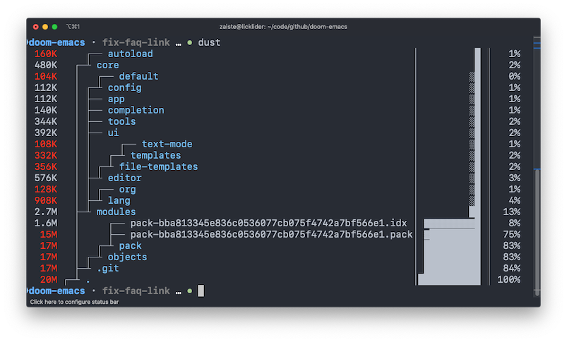
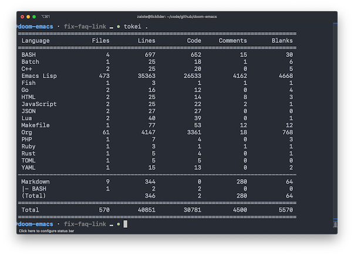
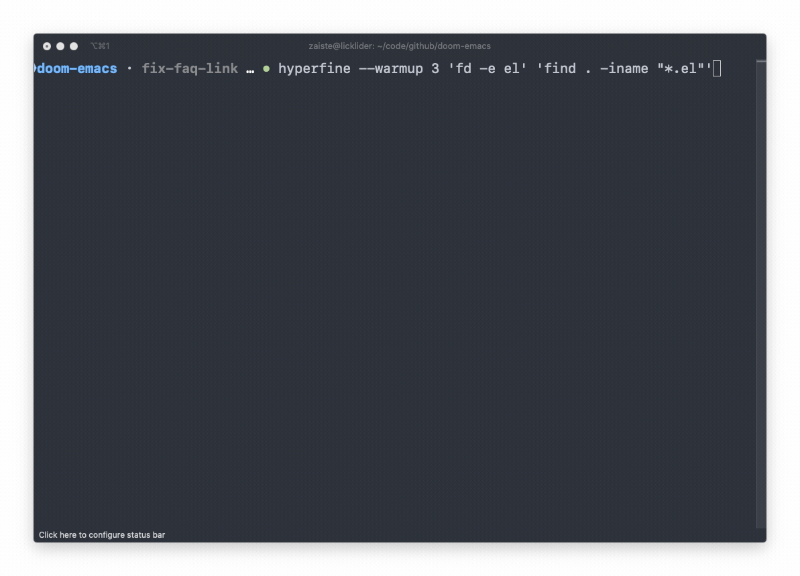
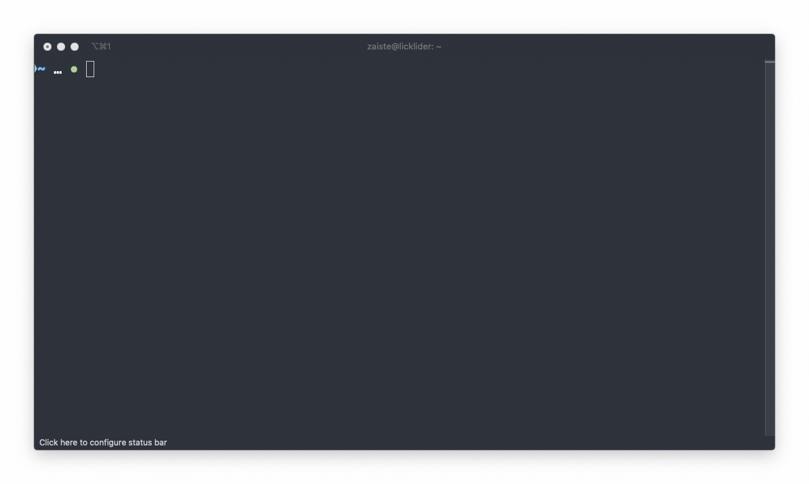
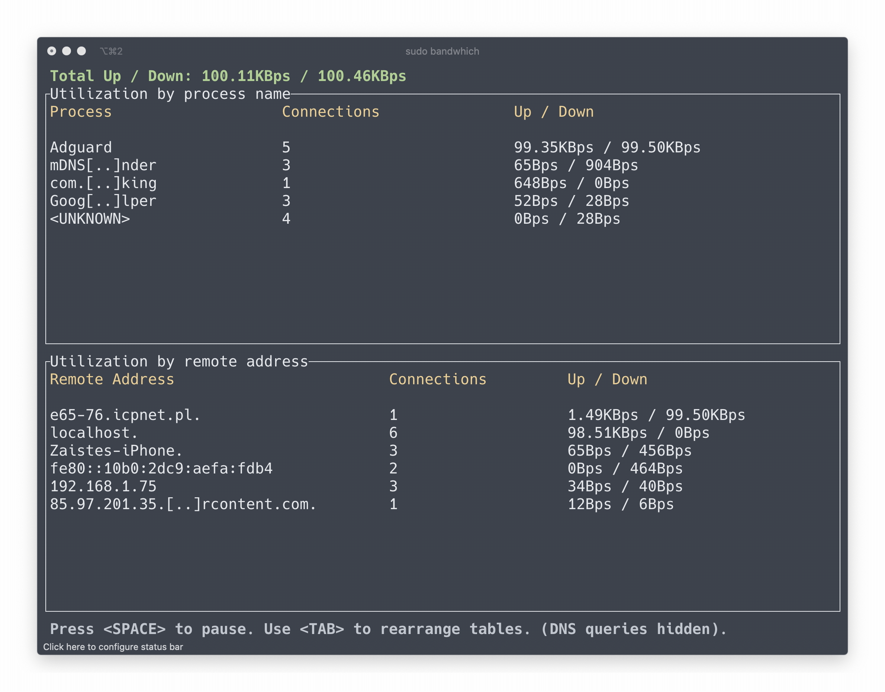
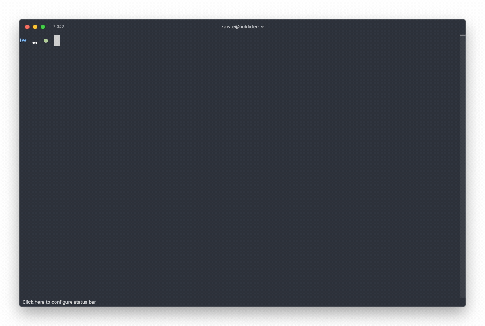
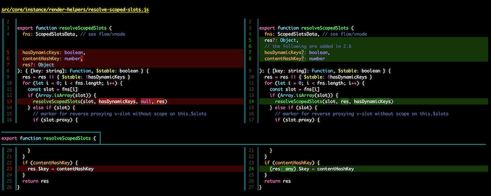

## 命令行工具
对于每一个程序员而言，命令行工具都非常关键。你对他越熟悉，在使用计算机、处理工作流程等越是高效。

下面我们收集了一些优秀的Rust所写的命令行工具，它们相比目前已有的其它语言的实现，可以提供更加现代化的代码实现、更加高效的性能以及更好的可用性。

## 目录
| 新工具 | 替代的目标或功能描述 | 
| ------ | ----------------- |
| [bat](#bat) | cat |
| [exa](#exa) | ls |
| [fd](#fd) | find |
| [procs](#procs) | ps | 
| [sd](#sd) | sed |
| [dust](#dust) | du |
| [starship](#starship) | 现代化的命令行提示 | 
| [ripgrep](#ripgrep) | grep |
| [tokei](#tokei) | 代码统计工具 | 
| [hyperfine](#hyperfine) | 命令行benchmark工具 | 
| [bottom](#bottom) | top |
| [teeldear](#tealdear) | tldr |
| [grex](#grex) | 根据文本示例正则 | 
| [bandwitch](#bandwhich) | 显示进程、连接网络使用情况|
| [zoxide](#zoxide) | cd |
| [delta](#delta) | git可视化 |
| [nushell](#nushell) | 全新的现代化shell |

### [bat](https://github.com/sharkdp/bat)
`bat`克隆了**cat**的功能并提供了语法高亮和Git集成，它支持`Windows`，`MacOS`和`Linux`。同时，它默认提供了多种文件后缀的语法高亮。

### [exa](https://github.com/ogham/exa)
`exa`是`ls`命令的现代化实现，后者是目前`Unix/Linux`系统的默认命令，用于列出当前目录中的内容。

### [fd](https://github.com/sharkdp/fd)
`fd`是一个更快、对用户更友好的**find**实现，后者是`Unix/Linux`内置的文件目录搜索工具。之所以说它用户友好，一方面是`API`非常清晰明了，其次是它对最常用的场景提供了有意义的默认值：例如，想要通过名称搜索文件：

- `fd`: `fd PATTERN`
- `find`: `find -iname 'PATTERN'`

同时`fd`性能非常非常高，还提供了非常多的搜索选项，例如允许用户通过`.gitignore`文件忽略隐藏的目录、文件等。

### [procs](https://github.com/dalance/procs)
`proc`是**ps**的默认实现，后者是`Unix/Linux`的内置命令，用于获取进程(`process`)的信息。`proc`提供了更便利、可读性更好的格式化输出。

 ### [sd](https://github.com/chmln/sd)
 `sd`是**sed**命令的现代化实现，后者是`Unix/Linux`中内置的工具，用于分析和转换文本。

 `sd`拥有更简单的使用方式，而且支持方便的正则表达式语法，`sd`拥有闪电般的性能，比`sed`快**2x-11x**倍。

以下是其中一个性能测试结果：

*对1.5G大小的JSON文本进行简单替换*

`hyperfine -w 3 'sed -E "s/\"/\'/g" *.json >/dev/null' 'sd "\"" "\'" *.json >/dev/null' --export-markdown out.md`

| Command | Mean [s] | Min…Max [s] |
|:---|---:|---:|
| `sed -E "s/\"/'/g" *.json >/dev/null` | 2.338 ± 0.008 | 2.332…2.358 |
| `sed "s/\"/'/g" *.json >/dev/null` | 2.365 ± 0.009 | 2.351…2.378 |
| `sd "\"" "'" *.json >/dev/null` | **0.997 ± 0.006** | 0.987…1.007 |

结果: ~2.35 times faster

### [dust](https://github.com/bootandy/dust)
`dust`是一个更符合使用习惯的**du**，后者是`Unix/Linux`内置的命令行工具，用于显示硬盘使用情况的统计。

### [starship](https://github.com/starship/starship)
命令行提示，支持任何`shell`，包括`zsh`，简单易用、非常快且拥有极高的可配置性, 同时支持智能提示。

### [ripgrep](https://github.com/BurntSushi/ripgrep)
`ripgrep`是一个性能极高的现代化`grep`实现，后者是`Unix/Linux`下的内置文件搜索工具。该项目是Rust的明星项目，一个是因为性能极其的高，另一个就是源代码质量很高，值得学习, 同时`Vscode`使用它作为内置的搜索引擎。

从功能来说，除了全面支持`grep`的功能外，`repgre`支持使用正则递归搜索指定的文件目录，默认使用`.gitignore`对指定的文件进行忽略。

### [tokei](https://github.com/XAMPPRocky/tokei)
`tokei`可以分门别类的统计目录内的代码行数，速度非常快！

### [hyperfine](https://github.com/sharkdp/hyperfine)
`hyperfine`是命令行benchmark工具，它支持在多次运行中提供静态的分析，同时支持任何的`shell`命令，准确的`benchmark`进度和当前预估等等高级特性。

### [bottom](https://github.com/ClementTsang/bottom)
`bottom`是一个现代化实现的`top`，可以跨平台、图形化的显示进程/系统的当前信息。

### [tealdear](https://github.com/dbrgn/tealdeer)
`tealdear`是一个更快实现的**tldr**, 一个用于显示`man pages`的命令行程序，简单易用、基于例子和社区驱动是主要特性。

### [bandwhich](https://github.com/imsnif/bandwhich)
`banchwhich`是一个客户端实用工具，用于显示当前进程、连接、远程IP(hostname)的网络信息。

### [grex](https://github.com/pemistahl/grex)
`grex`既是一个命令行工具又是一个库，可以根据用户提供的文本示例生成对应的正则表达式，非常强大。

### [zoxide](https://github.com/ajeetdsouza/zoxide)
`zoxide`是一个智能化的`cd`命令，它甚至会记忆你常用的目录。

### [delta](https://github.com/dandavison/delta)
`delta`是一个`git`分页展示工具，支持语法高亮、代码比对、输出`grep`等。

### [nushell](https://github.com/nushell/nushell)
`nushell`是一个全新的`shell`，使用`Rust`实现。它的目标是创建一个现代化的`shell`：虽然依然基于`Unix`的哲学，但是更适合现在的时代。例如，你可以使用`SQL`语法来选择你想要的内容！

