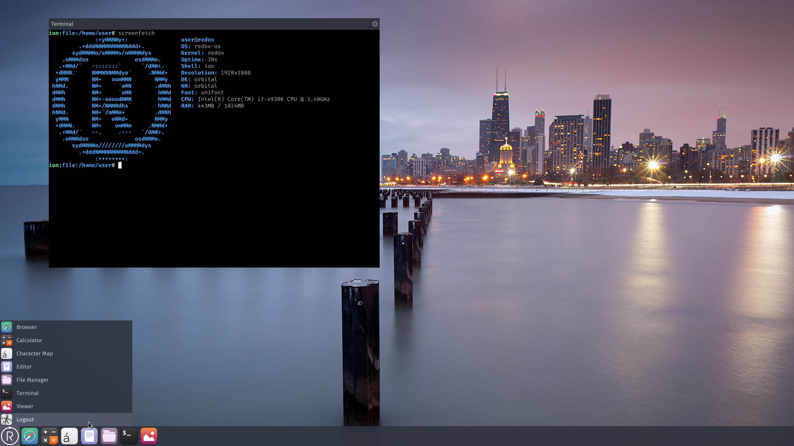
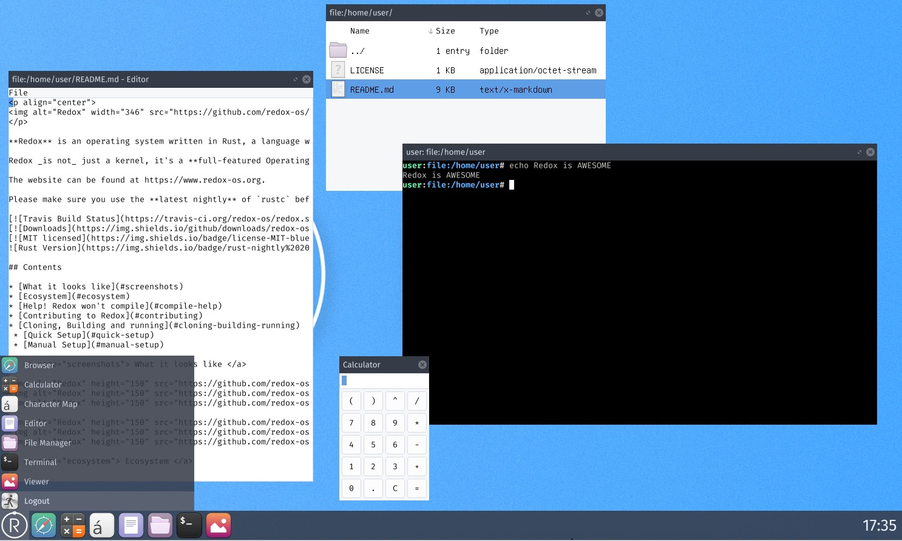

# 操作系统
操作系统范畴很大，本章节中收集的内容聚焦在用Rust实现的操作系统以及用Rust写操作系统的教程。

### [redox](https://github.com/redox-os/redox)
`Redox`是一个`Unix`风格的微内核操作系统，使用`Rust`实现。`redox`的目标是安全、快速、免费、可用，它在内核设计上借鉴了很多优秀的内核，例如：`SeL4`, `MINIX`, `Plan 9`和`BSD`。

但`redox`不仅仅是一个内核，它还是一个功能齐全的操作系统，提供了操作系统该有的功能，例如：内存分配器、文件系统、显示管理、核心工具等等。你可以大概认为它是一个`GNU`或`BSD`生态，但是是通过一门现代化、内存安全的语言实现的。

> 不过据我仔细观察，redox目前的开发进度不是很活跃，不知道发生了什么，未来若有新的发现会在这里进行更新 - Sunface

