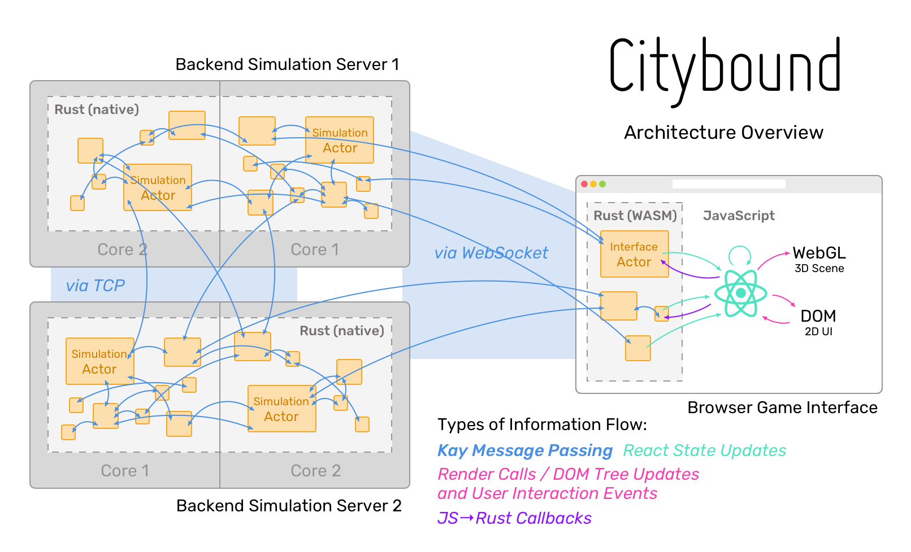

# 游戏
我们精心挑选了一些用Rust写得优秀游戏，希望大家喜欢：)

## 目录
| 游戏名   | 描述   | 
| ------ | ----- |
| citybound | 多人在线城市模拟游戏 | 
| doukutsu | `Cave Story`重制版 |
| rusted-ruins | 开发世界、像素游戏 |

### citybound
[citybound](https://github.com/citybound/citybound)是一个多人在线模拟游戏，使用Rust + WASM + JS开发。

### doukutsu
[doukutsu](https://github.com/doukutsu-rs/doukutsu-rs)是2004年发行的视频游戏`Cave Story`的重制版，使用Rust开发。

### rusted-ruins
[rusted-ruins](https://github.com/garkimasera/rusted-ruins)是一个开放世界2D像素游戏，用户可以在里面探索各种野外和废墟。

目前游戏还处于较为早期阶段，但是开发活跃。

